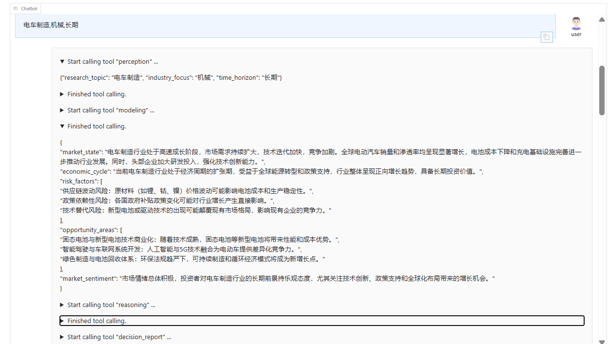
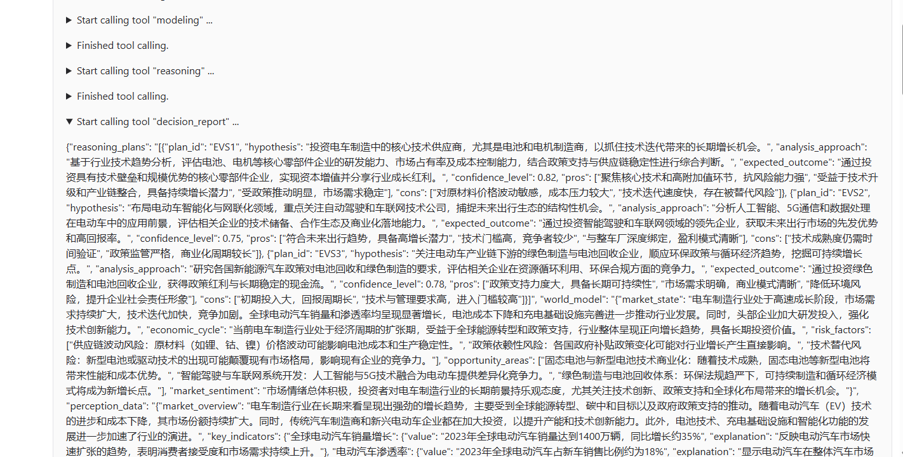
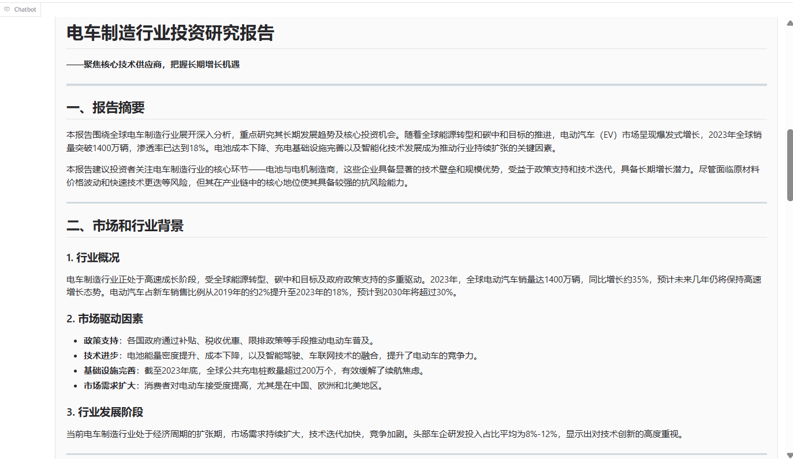
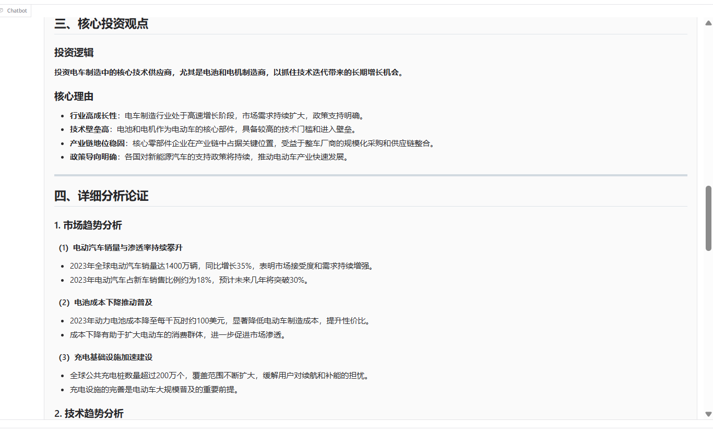
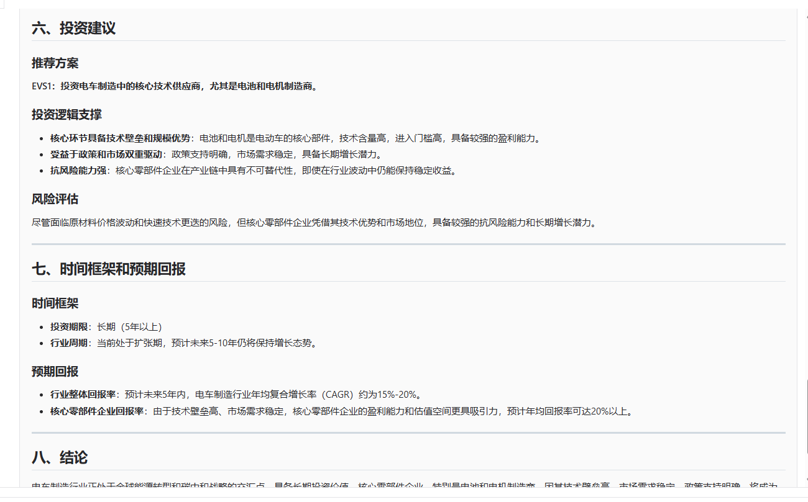
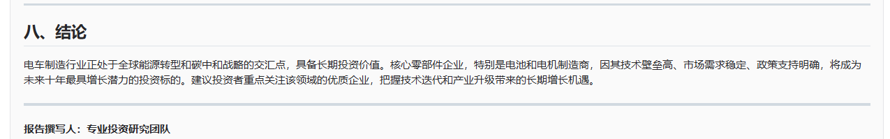

# 深思熟虑型投资研究助手

这是一个基于Qwen Agent和DashScope API的投资研究助手，能够分阶段完成市场感知、建模分析、推理方案生成、决策与报告。

## 项目截图

### Web 界面截图


*Web 图形界面展示*



### 报告生成示例


*生成的投资研究报告示例*






## 功能特性

- **市场感知**：收集和整理市场数据和信息，包括市场概况、关键指标、重要新闻和行业趋势
- **建模分析**：构建市场内部模型，评估市场状态、经济周期、风险因素和机会领域
- **推理方案**：生成多个不同的投资分析方案，提供多样化的投资思路
- **决策与报告**：选择最优投资方案并生成完整的投资研究报告
- **双界面支持**：提供终端交互和Web图形界面两种使用方式

## 安装依赖

1. 克隆项目到本地
2. 安装所需依赖：

```bash
pip install -r requirements.txt
```

## 配置

1. 设置环境变量 `DASHSCOPE_API_KEY`，填入你的DashScope API密钥

## 使用方法

### 终端模式

1. 修改 `main.py`，注释 `app_gui()` 并取消注释 `app_tui()`
2. 运行 `python main.py`
3. 按照提示输入研究主题、行业、周期（如：新能源,电力,中期）

### Web界面模式

1. 确保 `main.py` 中 `app_gui()` 未被注释
2. 运行 `python main.py`
3. 在浏览器中打开提示的URL

## 工作流程

1. **输入研究参数**：研究主题、行业焦点、时间范围
2. **市场感知**：收集和整理相关市场数据
3. **建模分析**：基于市场数据构建内部模型
4. **方案生成**：生成3个不同的投资分析方案
5. **决策与报告**：选择最优方案并生成完整研究报告

## 技术栈

- Python 3.8+
- DashScope API
- Qwen Agent
- Dash (Web界面)

## 注意事项

- 本项目依赖于DashScope API，需要有效的API密钥
- 生成的报告仅供参考，不构成投资建议
- 首次运行可能需要较长时间加载模型和依赖

## 项目结构

```
.
├── src/                     # 源代码目录
│   ├── interfaces/          # 界面模块
│   │   ├── __init__.py      # 包初始化文件
│   │   ├── gui.py           # Web界面实现
│   │   └── tui.py           # 终端交互界面实现
│   ├── tools/               # 工具模块
│   │   ├── __init__.py      # 包初始化文件
│   │   ├── perception_tool.py      # 市场感知工具，收集市场数据和信息
│   │   ├── modeling_tool.py        # 建模分析工具，构建市场内部模型
│   │   ├── reasoning_tool.py       # 推理方案生成工具，生成投资分析方案
│   │   └── decision_report_tool.py # 决策与报告工具，选择最优方案并生成报告
│   ├── __init__.py          # 包初始化文件
│   ├── agent.py             # 助手初始化，创建和配置投资研究助手
│   ├── config.py            # 配置文件，存储API密钥和模型配置
│   ├── llm_utils.py         # LLM调用工具，封装与DashScope API的交互
│   └── prompt_templates.py  # 提示模板，存储各种任务的提示文本
├── .gitignore               # Git忽略规则文件
├── README.md                # 项目说明文件
├── main.py                  # 主入口文件，启动应用程序
└── requirements.txt         # 依赖项文件，列出项目所需的Python包
```

## 文件说明

### 核心文件

- **main.py**：主入口文件，用于启动应用程序，可选择运行终端模式或Web界面模式
- **src/agent.py**：初始化投资研究助手，配置LLM和工具列表
- **src/config.py**：存储配置信息，包括API密钥和LLM配置参数

### 工具模块

- **src/tools/perception_tool.py**：市场感知工具，负责收集和整理市场数据和信息
- **src/tools/modeling_tool.py**：建模分析工具，基于市场数据构建内部模型
- **src/tools/reasoning_tool.py**：推理方案生成工具，生成多个投资分析方案
- **src/tools/decision_report_tool.py**：决策与报告工具，选择最优方案并生成研究报告

### 界面模块

- **src/interfaces/tui.py**：终端交互界面，提供命令行交互方式
- **src/interfaces/gui.py**：Web图形界面，提供浏览器交互方式

### 辅助模块

- **src/llm_utils.py**：封装LLM调用逻辑，处理与DashScope API的通信
- **src/prompt_templates.py**：存储各种任务的提示模板，用于指导LLM生成响应

## 扩展与定制

- **添加新工具**：在 `src/tools/` 目录下创建新的工具类，并在 `src/agent.py` 中注册
- **修改提示模板**：编辑 `src/prompt_templates.py` 中的提示文本
- **调整LLM配置**：修改 `src/config.py` 中的LLM配置参数
- **添加新界面**：在 `src/interfaces/` 目录下创建新的界面实现
